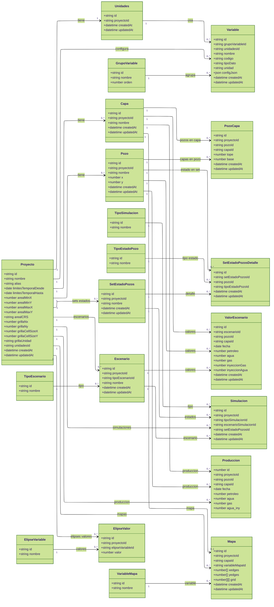

# Domain Truth (Mermaid)

> Fuente de verdad de dominio para backend v2.

```mermaid
---
config:
  layout: elk
  theme: forest
---
classDiagram
direction LR

class Proyecto {
  +string id
  +string nombre
  +string alias
  +date limitesTemporalDesde
  +date limitesTemporalHasta
  +number arealMinX
  +number arealMinY
  +number arealMaxX
  +number arealMaxY
  +string arealCRS
  +number grillaNx
  +number grillaNy
  +number grillaCellSizeX
  +number grillaCellSizeY
  +string grillaUnidad
  +string unidadesId
  +datetime createdAt
  +datetime updatedAt
}

class Unidades {
  +string id
  +string proyectoId
  +datetime createdAt
  +datetime updatedAt
}

class GrupoVariable {
  +string id
  +string nombre
  +number orden
}

class Variable {
  +string id
  +string grupoVariableId
  +string unidadesId
  +string nombre
  +string codigo
  +string tipoDato
  +string unidad
  +json configJson
  +datetime createdAt
  +datetime updatedAt
}

class Capa {
  +string id
  +string proyectoId
  +string nombre
  +datetime createdAt
  +datetime updatedAt
}

class Pozo {
  +string id
  +string proyectoId
  +string nombre
  +number x
  +number y
  +datetime createdAt
  +datetime updatedAt
}

class PozoCapa {
  +string id
  +string proyectoId
  +string pozoId
  +string capaId
  +number tope
  +number base
  +datetime createdAt
  +datetime updatedAt
}

class TipoSimulacion {
  +string id
  +string nombre
}

class TipoEstadoPozo {
  +string id
  +string nombre
}

class SetEstadoPozos {
  +string id
  +string proyectoId
  +string nombre
  +datetime createdAt
  +datetime updatedAt
}

class SetEstadoPozosDetalle {
  +string id
  +string setEstadoPozosId
  +string pozoId
  +string tipoEstadoPozoId
  +datetime createdAt
  +datetime updatedAt
}

class TipoEscenario {
  +string id
  +string nombre
}

class Escenario {
  +string id
  +string proyectoId
  +string tipoEscenarioId
  +string nombre
  +datetime createdAt
  +datetime updatedAt
}

class ValorEscenario {
  +string id
  +string escenarioId
  +string pozoId
  +string capaId
  +date fecha
  +number petroleo
  +number agua
  +number gas
  +number inyeccionGas
  +number inyeccionAgua
  +datetime createdAt
  +datetime updatedAt
}

class ElipseVariable {
  +string id
  +string nombre
}

class ElipseValor {
  +string id
  +string proyectoId
  +string elipseVariableId
  +number valor
}

class Simulacion {
  +string id
  +string proyectoId
  +string tipoSimulacionId
  +string escenarioSimulacionId
  +string setEstadoPozosId
  +datetime createdAt
  +datetime updatedAt
}

class Produccion {
  +number id
  +string proyectoId
  +string pozoId
  +string capaId
  +date fecha
  +number petroleo
  +number agua
  +number gas
  +number agua_iny
}

class VariableMapa {
  +string id
  +string nombre
}

class Mapa {
  +string id
  +string proyectoId
  +string capaId
  +string variableMapaId
  +number[] xedges
  +number[] yedges
  +number[][] grid
  +datetime createdAt
  +datetime updatedAt
}

Proyecto "1" --> "1" Unidades : tiene
Proyecto "1" --> "0..*" Variable : configura
GrupoVariable "1" --> "0..*" Variable : agrupa
Unidades "1" --> "0..*" Variable : usa

Proyecto "1" --> "0..*" Capa : tiene
Proyecto "1" --> "0..*" Pozo : tiene
Pozo "1" --> "0..*" PozoCapa : capas en pozo
Capa "1" --> "0..*" PozoCapa : pozos en capa

Proyecto "1" --> "0..*" Escenario : escenarios
TipoEscenario "1" --> "0..*" Escenario : tipo
Escenario "1" --> "0..*" ValorEscenario : valores
Pozo "1" --> "0..*" ValorEscenario : valores
Capa "1" --> "0..*" ValorEscenario : valores

Proyecto "1" --> "0..*" SetEstadoPozos : sets estados
Proyecto "1" --> "0..*" Simulacion : simulaciones

TipoSimulacion "1" --> "0..*" Simulacion : tipo
Escenario "1" --> "0..*" Simulacion : escenario
SetEstadoPozos "1" --> "0..*" Simulacion : estados

SetEstadoPozos "1" --> "0..*" SetEstadoPozosDetalle : detalle
Pozo "1" --> "0..*" SetEstadoPozosDetalle : estado en set
TipoEstadoPozo "1" --> "0..*" SetEstadoPozosDetalle : tipo estado

ElipseVariable "1" --> "0..*" ElipseValor : valores
Proyecto "1" --> "0..*" ElipseValor : elipses valores

Proyecto "1" --> "0..*" Mapa : mapas
Capa "1" --> "0..1" Mapa : mapa
VariableMapa "1" --> "0..*" Mapa : variable

Proyecto "1" --> "0..*" Produccion : produccion
Pozo "1" --> "0..*" Produccion : produccion
Capa "1" --> "0..*" Produccion : produccion
```
